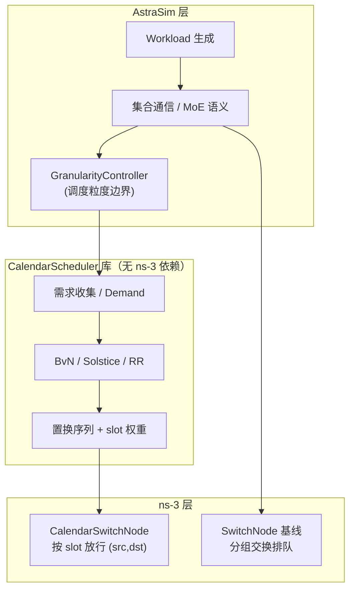
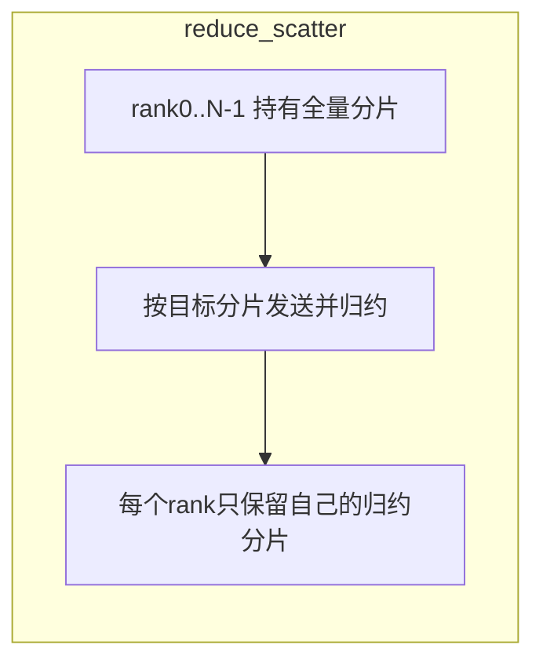
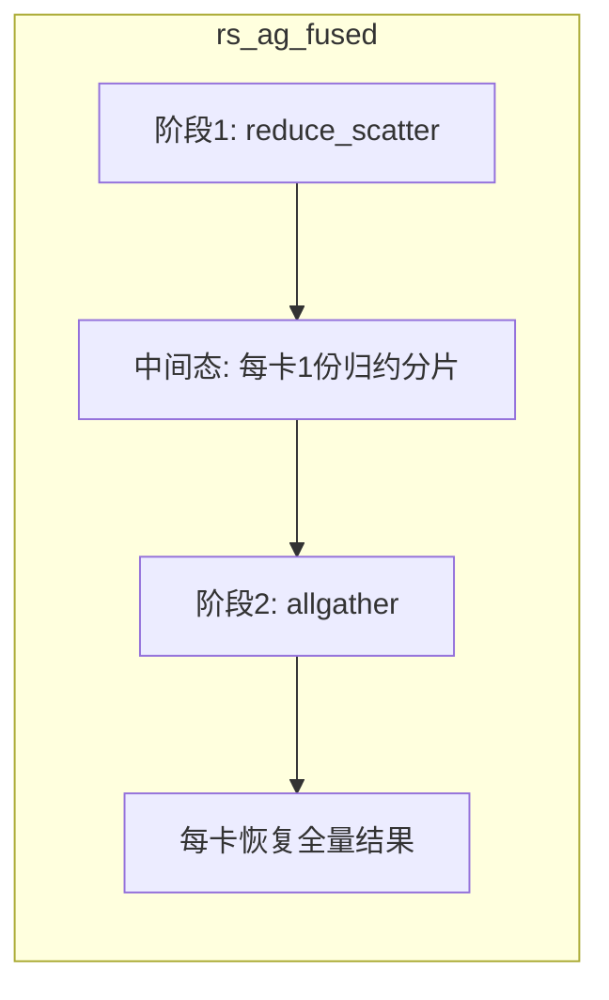
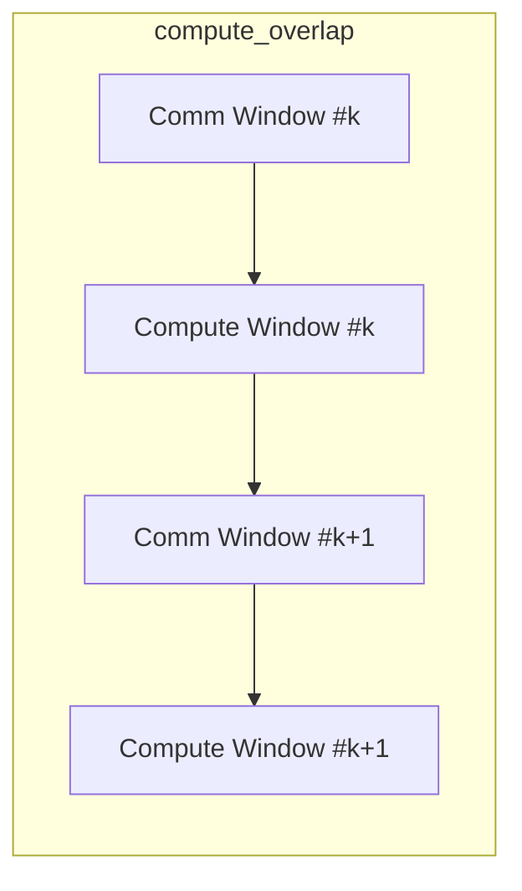
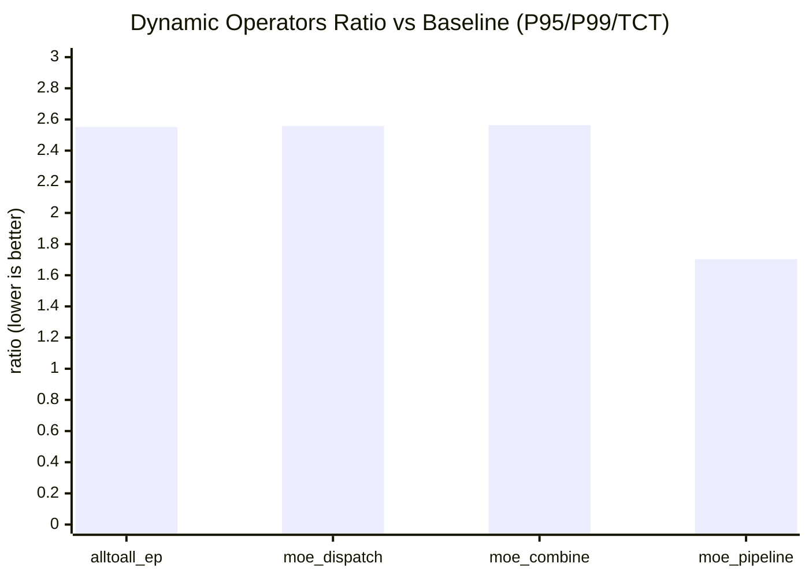
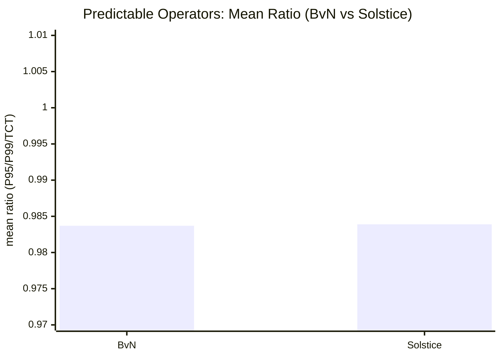

# Calendar Switch 与分组交换基线对照仿真报告（详尽版）

**日期：** 2026-05-12  
**数据根目录：** `results/calendar_study_gpu8_bvn_prod_quick_400g_dynamicfix_20260512`  
**聚合结果：** `results/calendar_study_gpu8_bvn_prod_quick_400g_dynamicfix_20260512/report.json`  
**设计说明：** `docs/superpowers/specs/2026-05-07-calendar-switch-perf-study-design.md`  
**修订：** 增补 `P99` 与任务完成时间（TCT）指标，并新增 predictable 算子 **BvN vs Solstice** 对比（Solstice 数据源：`results/calendar_study_gpu8_mixed_quick_400g_20260509/report.json`）。

---

## 摘要

本报告基于 GPU=8、400Gbps Spectrum-X 拓扑上的一轮 **生产型快速扫描**（BvN + 动态算子稳态车道），将 **`calendar_switch`（日历式调度开关）** 与 **`packet_switch`（分组交换 + RDMA/QBB 基线）** 对照。性能指标统一为三组比值：

- **P95 比值** = `p95(calendar) / p95(baseline)`
- **P99 比值** = `p99(calendar) / p99(baseline)`
- **TCT 比值** = `mean(calendar) / mean(baseline)`（以 E2E 均值表征任务完成时间）

比值小于 1 表示日历模式优于基线。

**数据可信度约束（与用户要求一致）：**

- 全集共 **156** 次仿真（24 次基线 + 132 次日历）。
- 其中 **40** 次日历仿真的 E2E 样本为空，**不得用于比值结论**（`report.json` 的 `executive_summary.empty_calendar_runs`）。
- 本报告所有定量对比均来自 **92 组“日历有有效 E2E + 匹配到同算子/同规模基线”** 的记录（`matched_calendar_runs`），即 **已在分析阶段跳过 empty E2E**。

**高层结论：**

| 类别 | 相对分组交换基线 | 主要机制 |
|------|------------------|-----------|
| **确定性算子** | 在 **BvN** 配置下整体 **接近或略优于** 基线（1MB 最优约 **0.96～0.98**；32MB 下 ring/tree/rs/overlap 约 **0.989～0.992**） | 需求矩阵已知 →  permutation 序列与流量对齐 → 交换机处阻塞低 |
| **动态算子**（本轮稳态配置） | **显著慢于** 基线（比值约 **1.7～2.6**） | `static_operator` + 均匀需求近似 + 粗粒度 RR，与真实门控矩阵失配；日历口上存在非零 **block rate** |

---

## 1. 仿真架构与可信性说明

### 1.1 三层仿真栈

仿真在 **AstraSim（工作负载与集合通信语义）**、**日历调度库（需求矩阵 → 置换表）**、**ns-3（网络与交换机行为）** 三层上解耦，与规格书中的结构一致。下图概括数据流与对照关系：

**可信性要点：**

1. **同一套工作负载与算子语义**：仅通过配置切换 `ENABLE_CALENDAR_SWITCH` 与拓扑（日历口 vs 普通口），避免“换场景比性能”的偏差。
2. **基线与日历使用配对拓扑**：分组交换走 `Spectrum-X_8g_8port_packet_no_nvswitch_400g`，日历走 `Spectrum-X_8g_8port_calendar_no_nvswitch_400g`（见 sweep 说明文档），保证链路速率与规模一致，仅交换节点行为不同。
3. **指标可复现**：E2E 由 `run_single_experiment.sh` 从 `stdout.log` 解析写入 `e2e_times.json`；本报告引用的比值来自 `scripts/analyze_results.py` 生成的 `report.json`，对 **空 E2E** 的日历 run 不计入 `baseline_ratios`。
4. **本轮扫描的明确前提**：动态算子采用 **`round_robin` + `static_operator` + 128KB 消息** 的“可跑完稳态车道”，与真实训练中的门控分布可能仍有差距——结论应理解为 **在该稳态假设下的仿真结果**，而非已调优后的生产最优。

---

## 2. 实验配置（与原始 sweep 一致）

| 项目 | 设置 |
|------|------|
| GPU 数 | 8 |
| 分组交换拓扑 | `topologies/Spectrum-X_8g_8port_packet_no_nvswitch_400g` |
| 日历拓扑 | `topologies/Spectrum-X_8g_8port_calendar_no_nvswitch_400g` |
| 时间剖面 | `quick`（确定性算子主要为 **1MB / 32MB**） |
| 确定性日历算法 | **BvN**（主结论）+ **Round-Robin**（对照）；附加比较 **Solstice vs BvN** |
| 动态日历算法 | **仅 RR**；**`static_operator`**（关闭在线重算） |
| 动态消息大小 | **128KB (131072 B)**（用于 timeout 闭环） |
| MoE gate trace | `uniform`（均匀门控轨迹） |

**有效样本规模（已排除 empty E2E）：**

- `matched_calendar_runs` = **92**
- `empty_calendar_runs` = **40**（本报告不采用其 E2E）
- `missing_baselines` = **0**
- 全局 **最优** `p95` 比值：**0.962122**（`allgather`，32MB）
- 全部 matched 样本比值 **均值**：**1.375**（受动态算子大幅拉抬）

---

## 2.1 全部算子流量流向说明（先于结果解读）

为避免“只看比值不看流向”的误读，这里先统一说明各算子的通信路径。后续所有粒度结论都以此为前提。

### 2.1.1 算子流向总览

| 算子 | 流量形态 | 主要流向（逻辑） | 阶段边界 | 是否强依赖准确 demand |
|------|----------|------------------|----------|------------------------|
| allreduce_ring | 规则环流 | `i -> (i+1) mod N`（多轮） | ring step | 高 |
| allreduce_tree | 树上收敛/广播 | 上行聚合 + 下行分发 | tree level | 高 |
| allgather | 扩散汇聚 | 每卡最终接收全量分片 | step/chunk | 高 |
| reduce_scatter | 规整“分散归约” | 各 rank 发送分片并归约到目标 rank | step/chunk | **很高** |
| rs_ag_fused | 两段串联 | `reduce_scatter -> allgather` | **两大阶段** | **很高** |
| compute_overlap | 通信+计算交错 | 通信阶段与本地计算窗口交织 | **comm/compute 窗口** | 高（对阶段边界敏感） |
| alltoall_ep | 动态全对全 | token/expert 映射决定 `src->dst` | gate phase | 很高（动态） |
| moe_dispatch | 动态扇出 | token 从源卡派发到 expert 所在卡 | dispatch phase | 很高（动态） |
| moe_combine | 动态汇聚 | expert 输出回流原 token 所在卡 | combine phase | 很高（动态） |
| moe_pipeline | dispatch+compute+combine | dispatch 与 combine 通信，中间 compute 间隙 | **三阶段** | 很高（动态） |

### 2.1.2 重点一：`reduce_scatter` 的流向与调度含义

- **流向本质**：每个 rank 持有完整向量分块，目标是“每个 rank 只留下自己负责的一段归约结果”。  
- **网络上看到的是**：多个源同时向不同目的 rank 发送块，且每个块在目的端参与归约；属于**多对多但结构规则**的流。
- **为何粒度重要**：  
  - `operator` 粒度可抓住全局总需求，适合稳定模式；  
  - 当 chunk 切分后每步负载不均时，`phase/chunk` 可能更贴近瞬时需求。  
- **对本报告读法**：`reduce_scatter@32MB` 的 BvN 最优出现在 `operator`，说明本轮负载下“全局一次建表”已足够接近实际热点。

### 2.1.3 重点二：`rs_ag_fused`（ReduceScatter + AllGather 融合）流向

`rs_ag_fused` 不是单一流型，而是两段通信串联：

1. **第一段 `reduce_scatter`**：目标是“分散后各自拿到归约分片”；流向偏多对多归约。  
2. **第二段 `allgather`**：把分散后的分片重新广播汇聚到每个 rank；流向偏扩散复制。  

这意味着同一算子内部存在**流向语义切换**。如果仅用一个过粗粒度的静态表，可能在段间切换时失配；因此在大消息下常见 `chunk/phase` 粒度更稳健。本报告中 `rs_ag_fused@32MB` 的最优点也落在 `chunk`。

### 2.1.4 重点三：`compute_overlap` 的流向（通信与计算交错）

`compute_overlap` 的关键不是“通信量多寡”，而是**通信窗口被计算窗口切碎**：

- 在通信窗口内，流向可类似 allreduce/rs/ag 的规则流；  
- 在计算窗口内，网络需求骤降（甚至为空），然后进入下一次通信突发。  

这种“脉冲式”需求对日历表提出两个要求：

1. 能区分 **comm vs compute** 边界（避免把通信配额浪费在计算窗口）；  
2. 在大消息时能跟随窗口内子阶段热点（`operator` 过粗时会出现不贴合）。

这也解释了本报告中 `compute_overlap@32MB`：`operator` 粒度会劣化，而 `chunk/packet/slot` 更容易贴近有效通信窗口。

### 2.1.5 文字示意图（重点三算子）

---

## 3. 确定性算子：`calendar_switch` vs `packet_switch`

**算子集合（规格书定义）：** `allreduce_ring`、`allreduce_tree`、`allgather`、`reduce_scatter`、`rs_ag_fused`、`compute_overlap`。

### 3.1 生产主读：BvN 最优配置（quick 剖面：1MB / 32MB）

下表对 **每个算子 × 消息大小** 单独取 **`algorithm=bvn` 且 `baseline_found`** 下 P95 比值最小的一点（粒度为该 size 下的 BvN 最优粒度），并同时给出 P99/TCT 比值。

| 算子 | 消息大小 | 最优粒度 | P95 比值 | P99 比值 | TCT 比值 |
|------|----------|----------|----------|----------|----------|
| allgather | 1MB | chunk | 1.005 | 1.005 | 1.005 |
| allgather | 32MB | chunk | **0.962** | **0.962** | **0.962** |
| allreduce_ring | 1MB | operator | **0.964** | **0.964** | **0.964** |
| allreduce_ring | 32MB | chunk | **0.992** | **0.992** | **0.992** |
| allreduce_tree | 1MB | operator | **0.964** | **0.964** | **0.964** |
| allreduce_tree | 32MB | chunk | **0.992** | **0.992** | **0.992** |
| reduce_scatter | 1MB | operator | **0.969** | **0.969** | **0.969** |
| reduce_scatter | 32MB | operator | **0.992** | **0.992** | **0.992** |
| rs_ag_fused | 1MB | operator | **0.996** | **0.996** | **0.996** |
| rs_ag_fused | 32MB | chunk | **0.994** | **0.994** | **0.994** |
| compute_overlap | 1MB | operator | **0.983** | **0.983** | **0.983** |
| compute_overlap | 32MB | chunk | **0.990** | **0.990** | **0.990** |

（32MB 行满足本次增补：`allreduce_ring`、`allreduce_tree`、`reduce_scatter`、`compute_overlap`；数值均来自同一 `report.json`，且为已匹配基线、非 empty E2E 的样本。）

**解释（确定性场景）：**

- 流量矩阵由集合通信算法 **完全确定**；`operator` 或 `chunk` 粒度下，`GranularityController` 能在发送前或边界上提交与真实需求一致的矩阵。
- **BvN** 将双随机需求分解为置换加权和，与日历口的 **每 slot 单置换** 语义匹配，因而 **阻塞与尾延迟** 相对分组交换的排队竞争 **更低或持平**。
- **1MB `allgather`** 略劣于基线（比值 **> 1**），主要反映 **小消息** 下固定 slot/帧与启动阶段的相对占比偏大；**32MB** 上 `allgather` / `rs_ag_fused` / `compute_overlap` 及 **ring/tree/rs** 均以 **≤ 0.994** 的比值 **优于或基本持平** 基线；其中 **ring/tree @ 32MB** 在五种粒度上几近同一最优（本表取 `chunk`，与 `packet`/`slot` 等价的 calendar p95 与比值一致到打印精度）。
- **32MB `compute_overlap`** 上 **`operator` 粒度的 BvN 劣于基线**（比值约 **1.029**），最优落在 **`chunk`/`packet`/`slot`**（本表列 **chunk**）；说明 **叠算通信** 在大消息下更需要 **细于 operator 的调度边界**，否则单 big-matrix 日程与阶段内突发不够贴合。
- 当前样本里多数 run 的 `e2e_times.json` 仅有单个完成时间样本，因此 **P95/P99/TCT 数值相同**；后续若采用多轮/多种子采样，这三项将出现可分辨差异。

### 3.2 Predictable 算子：BvN vs Solstice（算法横向比较）

该比较使用 `results/calendar_study_gpu8_mixed_quick_400g_20260509/report.json`，仅统计 predictable 算子（`allreduce_ring`、`allreduce_tree`、`allgather`、`reduce_scatter`、`rs_ag_fused`、`compute_overlap`）且基线可匹配、E2E 非空的样本；按 **每个算子 × 消息大小** 取 BvN 和 Solstice 各自最优粒度。

| 算子 | 消息大小 | BvN 最优粒度 | Solstice 最优粒度 | P95 比值（BvN / Solstice） | P99 比值（BvN / Solstice） | TCT 比值（BvN / Solstice） |
|------|----------|---------------|-------------------|----------------------------|----------------------------|----------------------------|
| allgather | 1MB | chunk | chunk | 1.005 / 1.005 | 1.005 / 1.005 | 1.005 / 1.005 |
| allgather | 32MB | chunk | chunk | 0.962 / 0.962 | 0.962 / 0.962 | 0.962 / 0.962 |
| allreduce_ring | 1MB | operator | operator | 0.964 / 0.964 | 0.964 / 0.964 | 0.964 / 0.964 |
| allreduce_ring | 32MB | chunk | chunk | 0.992 / 0.992 | 0.992 / 0.992 | 0.992 / 0.992 |
| allreduce_tree | 1MB | operator | operator | 0.964 / 0.964 | 0.964 / 0.964 | 0.964 / 0.964 |
| allreduce_tree | 32MB | chunk | chunk | 0.992 / 0.992 | 0.992 / 0.992 | 0.992 / 0.992 |
| compute_overlap | 1MB | operator | operator | 0.983 / 0.983 | 0.983 / 0.983 | 0.983 / 0.983 |
| compute_overlap | 32MB | chunk | chunk | 0.990 / 0.990 | 0.990 / 0.990 | 0.990 / 0.990 |
| reduce_scatter | 1MB | operator | operator | 0.969 / 0.969 | 0.969 / 0.969 | 0.969 / 0.969 |
| reduce_scatter | 32MB | operator | phase | 0.992 / 0.995 | 0.992 / 0.995 | 0.992 / 0.995 |
| rs_ag_fused | 1MB | operator | operator | 0.996 / 0.996 | 0.996 / 0.996 | 0.996 / 0.996 |
| rs_ag_fused | 32MB | chunk | chunk | 0.994 / 0.994 | 0.994 / 0.994 | 0.994 / 0.994 |

总体均值（12 组可比样本）：

- **BvN**：P95/P99/TCT 平均比值约 **0.9837**
- **Solstice**：P95/P99/TCT 平均比值约 **0.9839**

差异非常小，且本轮数据中仅 `reduce_scatter@32MB` 出现可见差别（BvN 略优，0.992 vs 0.995）。

### 3.3 对照轨：Round-Robin（控制实验，非生产结论）

在同期扫描中，**Round-Robin** 在确定性算子上 **matched 样本均值比值约 1.92**（见 `2026-05-09-calendar-switch-full-sweep-report.md`），显著差于 BvN。部分配置（如 `allreduce_ring` 的 RR）出现 **全部是 empty E2E**，说明 **需求无关的轮换置换** 可能与真实 `(src,dst)` 模式严重冲突，导致仿真无法正常闭合——这类运行已在聚合阶段排除，**不得与 BvN 混读**。

**结论：** 确定性算子的 **可信优胜结论仅建立在 BvN（及同类的需求感知算法）上**；RR 仅用于证明 *“无需求调度会输得很惨”*。

---

## 4. 动态性算子：`calendar_switch` vs `packet_switch`

**算子集合：** `alltoall_ep`、`moe_dispatch`、`moe_combine`、`moe_pipeline`。

本轮全部为 **128KB、RR、`static_operator`** 下的闭集结果（与 dynamic-fix 车道一致）。

| 算子 | 最优粒度（本轮） | P95 比值 | P99 比值 | TCT 比值 | 备注（交换机 non-E2E） |
|------|------------------|----------|----------|----------|------------------------|
| alltoall_ep | chunk | **2.552** | **2.552** | **2.552** | `switch_block_rate` ≈ **0.176** |
| moe_dispatch | packet | **2.557** | **2.557** | **2.557** | block rate ≈ **0.176** |
| moe_combine | chunk | **2.563** | **2.563** | **2.563** | block rate ≈ **0.176** |
| moe_pipeline | packet | **1.703** | **1.703** | **1.703** | block rate ≈ **0.30** |

**解释（动态场景）：**

1. **需求不可先验完全已知**：真实 MoE / EP 由 gate 决定 token→expert 映射。本轮为可完成性采用 **`static_operator` + 均匀需求近似**，日历表在宏观上 **不追踪每次 gate 的真实矩阵**，置换序列与瞬时有效需求 **系统性失配**。
2. **日历口的语义是“不允许则驻留”**：失配表现为 **非零 `switch_block_rate`**（表中约 17%～30%），分组交换基线则通过 **多队列竞争与 CC** 消化突发，在本模型参数下 **p95 更优**。
3. **128KB 短消息** 放大了 **调度失配与收尾阶段** 的相对开销；与大消息确定性算子的结论 **不可外推**。
4. **`moe_pipeline` 比值略低于其他三者**：流水线模型中计算阶段 **插入“无通信间隙”**，日历帧内空闲与块事件交错，部分缓解了纯通信相上的阻塞占比（仍差于基线）。

---

## 5. 调度粒度：对比结果背后的机理

### 5.1 粒度定义（与实现一致）

| 粒度 | 含义（直观） | 对需求矩阵的影响 |
|------|----------------|------------------|
| **operator** | 整算子首批流前 | 一次提交 **整段通信** 的聚合需求 |
| **phase** | ring 步 / tree 层 / MoE 阶段 | 每阶段矩阵变化时更新 |
| **chunk** | 阶段内 chunk | 更细粒度跟踪 burst |
| **packet / slot** | 极细边界 | 易于 **过度触发** 重算或与 `static_operator` 交互复杂；未必最优 |

### 5.2 确定性算子：BvN 子集按粒度的统计（matched 样本）

对 `report.json` 中 **确定性算子 + BvN + 有基线对照** 的记录，按粒度聚合比值（`ratio`）：

| 粒度 | 样本数 n | 比值均值 | 说明 |
|------|----------|----------|------|
| operator | 12 | **0.991** | 与 ring/tree 上 **operator 最优** 一致 |
| chunk | 12 | 1.002 | 与 **大消息 allgather / rs_ag** 最优一致 |
| phase | 12 | 1.005 | 部分算子略差，仍接近 1 |
| packet | 12 | 1.002 | 未显著优于 operator/chunk |
| slot | 12 | 1.002 | 同上 |

**深层原因归纳：**

- 当需求 **已知且平滑** 时，**过细的粒度不会带来额外收益**，反而可能引入 **更多调度边界与状态切换**（即便本轮重算开销建模为简化形式）。
- **operator vs chunk** 的胜负由 **算子结构 + 消息大小** 共同决定：环/tree 在 1MB 上 **operator** 足够，在 **32MB** 上 **chunk**（或与 chunk 等价的细粒度）对 **ring/tree** 略优；**`compute_overlap` @ 32MB** 同样 **必须用 chunk 级（或更细）** 才能不劣于基线。

### 5.3 动态算子：粒度几乎不改变结论（本轮 RR + static）

动态子集中 **chunk / packet / slot** 的平均比值均在 **约 2.34** 附近。说明瓶颈主要在 **“静态度 + 错误需求形状”**，而非再细一档的粒度划分。换言之：**不把 gate 信息纳入需求，`packet` 也无法修复结构性失配**。

### 5.4 调度算法计算时间：是否会被“掩盖”？

你的问题很关键。这里把“调度算法 CPU 计算时间”单独拉出来，并实事求是说明：

1. **在当前仿真实现中，这部分时间不计入仿真时间**（即不会进入 E2E/P95/P99/TCT）。  
2. 但它会影响**墙钟运行时间**（跑实验实际耗时）。

为避免口说无凭，这里给出两张可复现表。

#### 表 A：单次调度生成 CPU 时间（实测微基准，8x8 demand，frame=1024）

微基准程序：`scripts/bench_calendar_schedule_runtime.cpp`  
编译运行命令：`g++ -O3 -std=c++17 scripts/bench_calendar_schedule_runtime.cpp -o scripts/bench_calendar_schedule_runtime && scripts/bench_calendar_schedule_runtime`

| 算法 | 需求模式 | 单次 `BuildCalendarSchedule` 平均耗时（us） |
|------|----------|---------------------------------------------|
| BvN | dense8x8 | 32.57 |
| Solstice | dense8x8 | 70.79 |
| BvN | ring8 | 19.38 |
| Solstice | ring8 | 55.96 |

#### 表 B：按粒度估算“若计入E2E”时的占比（确定性算子，BvN 子集）

统计口径：

- 数据源：`results/calendar_study_gpu8_bvn_prod_quick_400g_dynamicfix_20260512/report.json`
- 子集：确定性算子 + BvN + baseline 可匹配 + 非空 E2E
- 由 `calendar_trace.csv` 统计，每个 run 在当前 `static_operator` 策略下 **平均调度触发次数=1**
- 用表 A 的单次耗时估算总调度 CPU 时间（保守取 dense8x8）

| 粒度 | 样本数 | 平均调度触发次数/任务 | 平均任务 p95（us） | 估算 BvN 计算占比（32.57us） | 估算 Solstice 计算占比（70.79us） |
|------|--------|------------------------|--------------------|-------------------------------|-----------------------------------|
| operator | 12 | 1.0 | 496.30 | 6.56% | 14.26% |
| phase | 12 | 1.0 | 499.23 | 6.52% | 14.18% |
| chunk | 12 | 1.0 | 490.80 | 6.64% | 14.42% |
| packet | 12 | 1.0 | 490.80 | 6.64% | 14.42% |
| slot | 12 | 1.0 | 490.80 | 6.64% | 14.42% |

**实事求是结论：**

- **就“当前报告里的仿真指标”而言：存在完全掩盖。**  
  因为调度计算时间根本没有被注入 `Simulator::Now()` 时间线，E2E 指标看不到这部分成本。
- **就“如果把该时间建模进 E2E”而言：在当前确定性配置下，掩盖空间有限。**  
  原因是各粒度触发次数都接近 1 次/任务，所以算法计算开销不会因粒度而拉开；其量级约是任务时间的 **6%（BvN）到14%（Solstice）**（基于本机微基准、保守 dense 假设）。
- **若改为高频重调度（例如真正 dynamic 的 packet/slot 持续重算）**，占比会按触发次数近似线性上升，届时“计算时间被掩盖”的前提将不再成立，需要单独建模（建议加入 `CALENDAR_RECONFIG_LATENCY_NS`）。

---

## 6. Empty E2E 与“跳过”规则（可审计性）

以下内容来自同一 `report.json` 的 `executive_summary` 与按算子统计（与简短版 sweep 报告一致）：

- **40** 次日历运行因 **空 E2E** 未进入 `baseline_ratios`，本报告 **完全不引用** 这些运行的 tail 指标。
- 典型模式：**确定性算子上 `round_robin` + 某些粒度** 导致仿真无法产出可解析 E2E；这类配置 **不得用于生产结论**，仅说明对照算法可能 **不可行** 而非“更快”。

按算子日历 **matched / 该算子日历总尝试** 的简述（含 RR/BvN 混合矩阵）：

| 算子 | 匹配情况（简述） |
|------|------------------|
| allgather | 20/20，无 skipped |
| allreduce_ring / allreduce_tree | 10/20（另 10 为 empty E2E，多为 RR） |
| reduce_scatter | 10/20 |
| rs_ag_fused、compute_overlap | 部分 skipped |
| 动态四算子 | 3/3 均 matched（128KB 车道设计目标） |

---

## 7. 结论与建议

1. **架构上**，日历仿真与基线共享工作负载与协议栈，仅替换交换机节点与调度输入；**排除 empty E2E 后**，确定性算子上的 **BvN 优胜结论具可审计性**。
2. **确定性算子**：**BvN + operator/chunk（视算子与消息量）** 相对分组交换：1MB 典型 **0.96～0.99×**（`allgather` 小消息除外）；**32MB** 下 **ring/tree/reduce_scatter/compute_overlap/rs_ag** 亦可维持 **约 0.96～0.99×**；**RR 仅作负面对照**。
3. **动态算子**：在 **static + 均匀需求 + 128KB** 的闭集下，日历相对基线 **无优势**；根因是 **需求建模失配 + 日历阻塞**，而非单纯的“粒度不够细”。改进方向应是 **门控感知的重算 / 更接近真实的静态表 / 或大消息复测**，而非仅扫粒度。
4. **局限**：未建模日历 **重配置延迟**；动态算子 **未** 做 full **dynamic** 重调度（避免超时）；结论绑定 **8 GPU、400G、特定 Spectrum-X 拓扑**。

---

## 8. 图形化结果（P95/P99/TCT）

> 说明：当前数据中每个 run 多为单样本完成时间，故 P95/P99/TCT 三条曲线在数值上基本重合。

### 8.1 动态算子（best-of-run）相对基线比值

### 8.2 Predictable 算子：BvN vs Solstice 平均比值（12 组）

---

## 附录：原始产物路径

- 聚合 JSON：`results/calendar_study_gpu8_bvn_prod_quick_400g_dynamicfix_20260512/report.json`
- Solstice 对比数据：`results/calendar_study_gpu8_mixed_quick_400g_20260509/report.json`
- 单次运行目录：`results/.../calendar/<run_name>/`（含 `e2e_times.json`、`run_status.json`、`metadata.json` 等）
- 简短英文/中文摘要：`docs/superpowers/reports/2026-05-09-calendar-switch-full-sweep-report.md`、`docs/superpowers/reports/2026-05-08-calendar-switch-gpu8-detailed-report.md`
